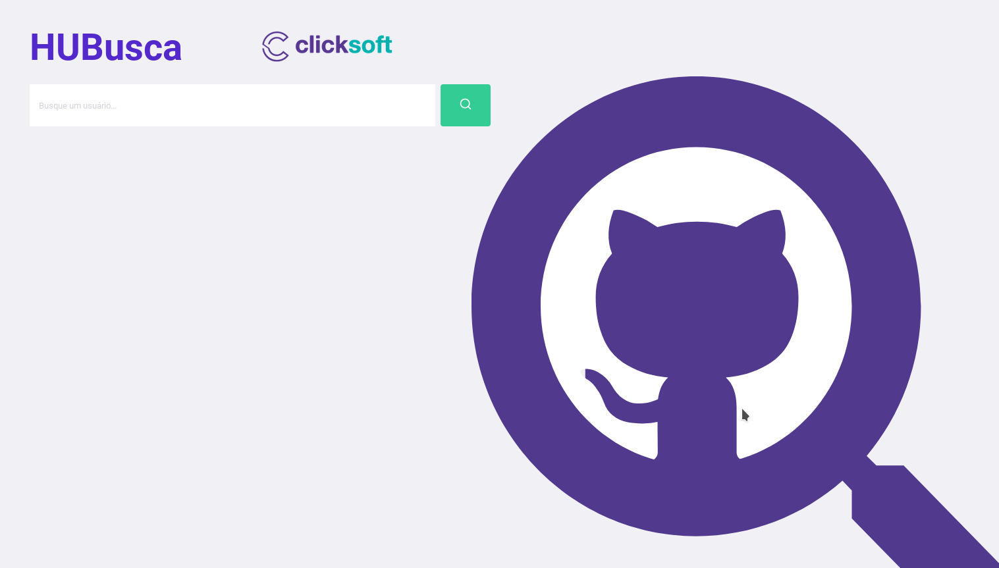
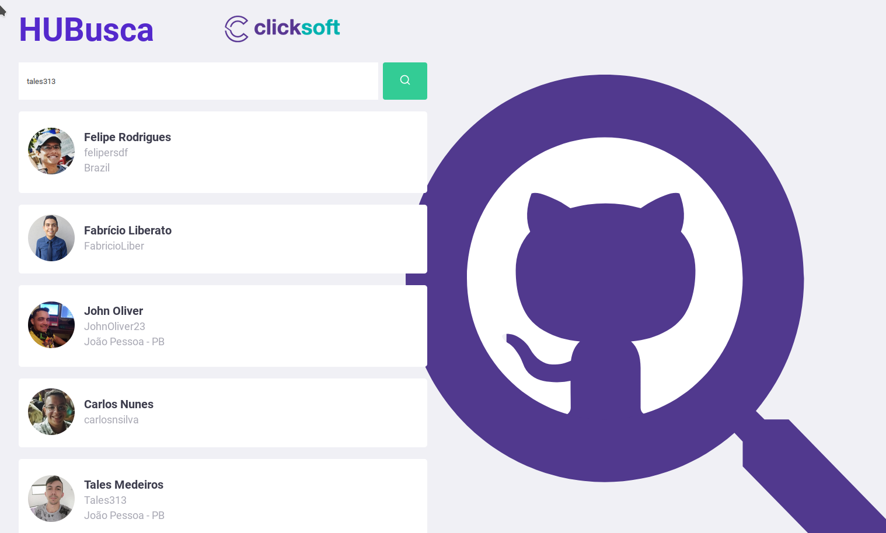
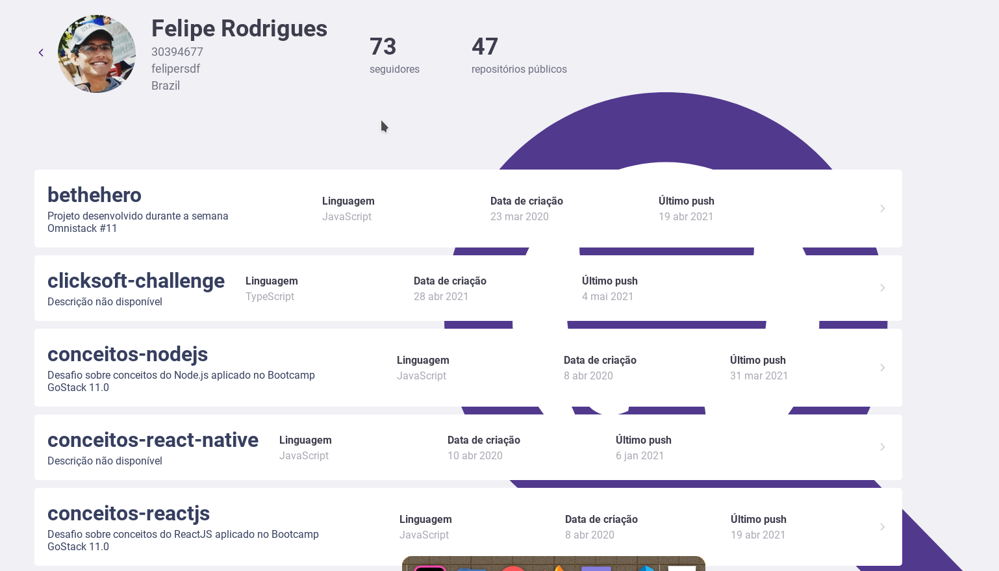

🔎 <strong>HUBusca</strong> 
Desafio para vaga de front-end feito pela ClickSoft.

  

  

  

  

    <a href="#sobre">Sobre</a>&nbsp;&nbsp;&nbsp;|&nbsp;&nbsp;&nbsp;
    <a href="#tecnologias">Tecnologias</a>&nbsp;&nbsp;&nbsp;|&nbsp;&nbsp;&nbsp;
    <a href="#testando-a-aplicação">Testando a aplicação</a>&nbsp;&nbsp;&nbsp;|&nbsp;&nbsp;&nbsp;
    <a href="#layout-da-aplicação">Layout da aplicação</a>&nbsp;&nbsp;&nbsp;|&nbsp;&nbsp;&nbsp;
  

## :bookmark: Sobre

Um wep-app que tem como objetivo ter mais facilidade e rapidez nas buscas de devs pelo github.

## 🚀 Tecnologias

Estas foram as tecnologias utilizadas nesse projeto:

- ⚛️ [TypeScript](https://www.typescriptlang.org/)
- ⚛️ [React JS](https://reactjs.org/)
- ⚛️ [NextJS](https://nextjs.org/)

---

## 🎨 Layout da aplicação

  
 Página Inicial 

  

---

 
Pagina após a busca realizada

 

---

 
Página de um dev específico

 

---

## 🧭 Testando a aplicação

Você pode acessar a aplicação e testá-la através desse link: [HUBuca](https://angry-brown-be2be4.netlify.app/)

---

Made by [Felipe Rodrigues](http://github.com/feliprsdf)
